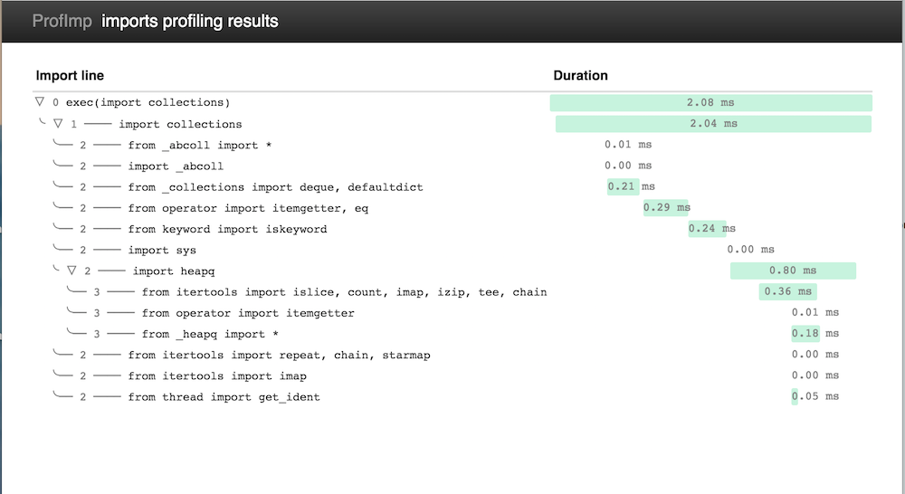

===============================
Profimp - python imports tracer
===============================

.. image:: https://img.shields.io/coveralls/boris-42/profimp.svg
    :target: https://coveralls.io/r/boris-42/profimp

.. image:: https://api.travis-ci.org/boris-42/profimp.svg?branch=master
    :target: https://travis-ci.org/boris-42/profimp

.. image:: https://img.shields.io/pypi/v/profimp.svg
    :target: https://pypi.python.org/pypi/profimp

Profimp allows you to trace imports of your code.

This lib should be used to simplify optimization of imports in your code.
At least you will find what consumes the most part of time and do the
right decisions.

Installation
------------

Installation of profimp is super easy:

.. code-block:: bash
  
   # Note you might need to use virtualenv
   pip install profimp

or

.. code-block:: bash

    git clone https://github.com/boris-42/profimp && cd profimp
    python setup.py install

Usage
-----

Syntax:

.. code-block:: bash

    profimp [import_module_line] [--html]

Samples:

.. code-block:: bash

    profimp "import collections"

    profimp "from somemoudle import something"

    prpfimp --html "import multiprocessing"

Pretty HTML reports
-------------------

if you run prpfimp with --html key you will get pretty html output

.. code-block:: bash

  profimp "import collections"

Raw JSON Results
----------------

In output you will see something like:

.. code-block:: json

    profimp "import collections"

    {
      "level": 0,
      "finished_at": 1427986324.921502,
      "import_line": "root",
      "duration": 1.0581016540527344,
      "started_at": 1427986324.920444,
      "children": [
        {
          "level": 1,
          "finished_at": 1427986324.9215,
          "import_line": "import collections",
          "duration": 1.0390281677246094,
          "started_at": 1427986324.920461,
          "children": [
            {
              "level": 2,
              "finished_at": 1427986324.920694,
              "import_line": "from _abcoll import *",
              "duration": 0.006198883056640625,
              "started_at": 1427986324.920688,
              "children": []
            },
            {
              "level": 2,
              "finished_at": 1427986324.920702,
              "import_line": "import _abcoll",
              "duration": 0.0019073486328125,
              "started_at": 1427986324.9207,
              "children": []
            },
            {
              "level": 2,
              "finished_at": 1427986324.920891,
              "import_line": "from _collections import deque, defaultdict",
              "duration": 0.1850128173828125,
              "started_at": 1427986324.920706,
              "children": []
            },
            {
              "level": 2,
              "finished_at": 1427986324.920899,
              "import_line": "from operator import itemgetter, eq",
              "duration": 0.00286102294921875,
              "started_at": 1427986324.920896,
              "children": []
            },
            {
              "level": 2,
              "finished_at": 1427986324.921064,
              "import_line": "from keyword import iskeyword",
              "duration": 0.16188621520996094,
              "started_at": 1427986324.920902,
              "children": []
            },
            {
              "level": 2,
              "finished_at": 1427986324.92107,
              "import_line": "import sys",
              "duration": 0.0021457672119140625,
              "started_at": 1427986324.921068,
              "children": []
            },
            {
              "level": 2,
              "finished_at": 1427986324.921402,
              "import_line": "import heapq",
              "duration": 0.3299713134765625,
              "started_at": 1427986324.921072,
              "children": [
                {
                  "level": 3,
                  "finished_at": 1427986324.921241,
                  "import_line": "from itertools import islice, count, imap, izip, tee, chain",
                  "duration": 0.0040531158447265625,
                  "started_at": 1427986324.921237,
                  "children": []
                },
                {
                  "level": 3,
                  "finished_at": 1427986324.921246,
                  "import_line": "from operator import itemgetter",
                  "duration": 0.0021457672119140625,
                  "started_at": 1427986324.921244,
                  "children": []
                },
                {
                  "level": 3,
                  "finished_at": 1427986324.921391,
                  "import_line": "from _heapq import *",
                  "duration": 0.13899803161621094,
                  "started_at": 1427986324.921252,
                  "children": []
                }
              ]
            },
            {
              "level": 2,
              "finished_at": 1427986324.921409,
              "import_line": "from itertools import repeat, chain, starmap",
              "duration": 0.00286102294921875,
              "started_at": 1427986324.921406,
              "children": []
            },
            {
              "level": 2,
              "finished_at": 1427986324.921413,
              "import_line": "from itertools import imap",
              "duration": 0.0019073486328125,
              "started_at": 1427986324.921411,
              "children": []
            },
            {
              "level": 2,
              "finished_at": 1427986324.921455,
              "import_line": "from thread import get_ident",
              "duration": 0.03981590270996094,
              "started_at": 1427986324.921415,
              "children": []
            }
          ]
        }
      ]
